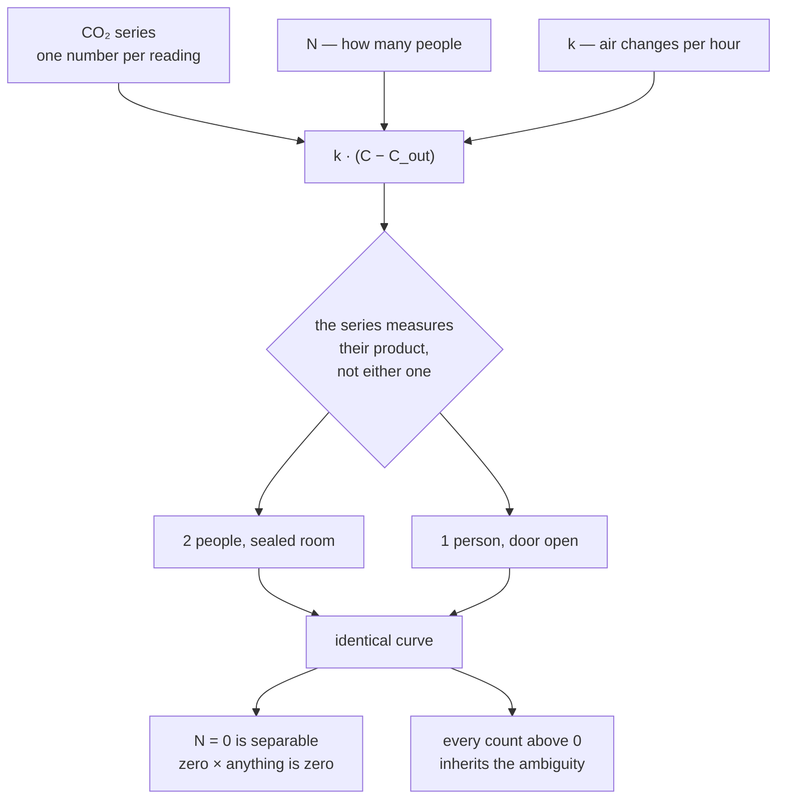

# How far can one CO2 sensor see?

A room's air keeps a record of who has been in it. This reads that record with
a single consumer sensor and nothing else — no camera, no motion detector, no
occupancy labels to train on — and maps exactly where the attempt stops working.

**The answer, established six independent ways: you can tell whether a room is
occupied. You cannot tell how many people are in it.** The second is not a gap
in the engineering. It is a property of the physics, and most of this project
is the evidence for that.

*The underlying data is not published — an occupancy series is a record of when
a home is empty. Only aggregates and time-of-day patterns appear here.*

## The idea

A person exhales roughly 18 L of CO2 per hour. In a room of volume `V`
ventilating at `k` air changes per hour, the concentration follows a mass
balance, and the occupancy `N` solves out of it directly:

```
dC/dt = (G·N·10⁶)/V − k·(C − C_out)      →      N = (dC/dt + k·(C − C_out))·V / (G·10⁶)
```

Nothing is trained. `N` is not fitted to labels, it is solved for — which is
why the method transfers to any room by measuring its volume, where a
classifier would have learned one occupant's timetable instead.

## Where it stops



Occupancy and ventilation enter the mass balance in the same term, so one CO2
series measures their product. Two people in a sealed room and one person with
the door open produce the same curve; nothing in the air distinguishes them.

Emptiness survives because zero times anything is still zero. Every count above
it does not. That single fact explains why the model separates occupied from
empty at 100% on the last confirmed-empty window and gets two people right 42%
of the time; why four attempts at a second channel failed; and why the CO2
generation rate could only be measured across a window where occupancy was
independently known.

Breaking the tie needs information from outside the CO2 series — ventilation
measured directly, or occupancy recorded at the time. Which of those work, and
which turned out not to, is [the failure catalogue](docs/failures.md).

The limit itself rests on physics and on six refuted attempts to get around it.
The occupancy figures quoted above rest on much less: occupancy recorded as it
changed, which so far covers one day and 250 samples. That is enough to show
the model beats a calendar rule on some readings of the day and loses on
others, and not enough to settle which. More is accumulating;
[what it would take](docs/validation.md) is set out there rather than
glossed.

## What broke

The interesting part. Each was assumed, then measured, then abandoned:

| Assumption | What measurement showed |
|---|---|
| The export's 1-minute resolution is real | 88.5% of consecutive readings are byte-identical padding |
| Outdoor air is 415 ppm | The room relaxes toward the building, which drifts 436–621 ppm by hour |
| One ventilation rate describes the record | It ranges from 0.12 sealed to over 2.5 with a window open |
| Regularising that rate fixes it | It capped absurd peaks at 5.3 people in a room that holds two |
| Temperature can see body heat | 100 W loses to a server rack's continuous load |
| Temperature can see arrivals via air conditioning | The signal is real; the decoder gain is not established |
| The rack's thermal delta measures ventilation | Correlation +0.07 across ten days of paired sensors |
| Overnight CO2 reflects how many people are elsewhere in the home | Two groups of nights differ by 40 ppm, p = 0.48 |

And one methodological failure worth more than the rest: **the validation
metric was reproducible by a calendar rule that reads no sensor at all**, which
scored 100% where the model scored 72.5%. Every accuracy figure resting on it
was withdrawn. [The full account](docs/validation.md).

## Reading path

Three notebooks, in order, with figures:

1. [`01_signal.ipynb`](notebooks/01_signal.ipynb) — what the sensor actually gives you
2. [`02_ventilation.ipynb`](notebooks/02_ventilation.ipynb) — recovering air exchange from decay curves alone
3. [`03_occupancy.ipynb`](notebooks/03_occupancy.ipynb) — the inversion, why it is ill-posed, and the discrete decoding that fixes what it can

```
src/load.py         parsing, cleaning, resampling to the sensor's real cadence
src/baseline.py     the CO2 asymptote, estimated rather than assumed
src/ventilation.py  per-episode decay fits, regularised into a rate over time
src/occupancy.py    the mass-balance inversion
src/states.py       Viterbi decoding over {0, 1, 2} occupants   <- the model that works
src/joint.py        two decoders that did not work, kept deliberately
src/thermal.py      the second channel, unvalidated
src/generation.py   CO2 output per person, checked against its source (43 tests)
src/simulate.py     a synthetic room, to measure what the real one cannot
```

And the collection side — a five-minute poll and a daily repair, both surviving
failures the other cannot: [how that works and why none of the data is
published](docs/data-handling.md).

```
src/ingest.py  src/pipeline.py  src/backfill.py  src/history_source.py  src/label.py
```

`git log` is worth a look: the history records the assumptions breaking in the
order they broke.

## Reproducing this

`pip install -r requirements.txt`. The readings are not in the repository and
cannot be, so the notebooks need a directory of their own data; `src/paths.py`
says where it is looked for. Everything except gap repair runs without
configuring a history source. Any CO2 series with the same columns will do.

## References

Persily, A., & de Jonge, L. (2017). Carbon dioxide generation rates for
building occupants. *Indoor Air*, 27(5), 868–879.
[doi:10.1111/ina.12383](https://doi.org/10.1111/ina.12383) — the source
`src/generation.py` implements and `tests/test_generation.py` asserts against.
